# Financial Sentiment Analysis and Next Day Stock Closes Prediction
This project employs FinBERT for sentiment analysis of financial articles and integrates the resulting scores with deep learning models to predict next-day stock closing prices. It draws inspiration from the approach in "Financial Sentiment Analysis Using FinBERT with Application in Predicting Stock Movement" (arXiv:2306.02136v3), which used non-fine-tuned sentiment scores to forecast next-day closing prices for individual tickers.

Key methodological differences include:
- Incorporating the full article body and footer, rather than just the headline.
- Fine-tuning the pre-trained FinBERT model using NSI-derived labels.
- Training and evaluating vanilla and FinBERT-enhanced predictive models across all tickers, instead of per ticker.
- Filtering articles based on absolute sentiment score magnitudes above various thresholds and comparing model performances.

The objective is to show how sentiment-enhanced features boost prediction accuracy compared to vanilla models relying solely on lagged OHLCV data. Results are summarized below, followed by a discussion of the methodologies.

## Results
### Performance Metrics
Incorporating sentiment scores led to consistent reductions in MSE across training, validation, and test sets for most models at a 0.8 sentiment threshold (except GRU). This underscores the value of sentiment in capturing market dynamics and enhancing forecast reliability beyond basic lagged OHLCV features in financial time-series data.
However, a lower threshold of 0.5 introduced more noise, resulting in higher MSE values and less consistent improvements.

#### All tickers, sentiment threshold = 0.8
| Model | Variant | Train MSE | Val MSE | Test MSE |
|-------|---------|-----------|---------|----------|
| RNN | Vanilla | 1.4127e-05 | 2.1847e-06 | 4.0529e-06 |
| RNN | Sentiment | 9.6809e-06 | 1.8499e-06 | 1.9911e-06 |
| GRU | Vanilla | 1.2065e-05 | 3.2257e-06 | 4.4572e-06 |
| GRU | Sentiment | 1.3904e-05 | 3.2427e-06 | 4.2571e-06 |
| Transformer | Vanilla | 3.3365e-05 | 3.5828e-06 | 9.8491e-06 |
| Transformer | Sentiment | 2.1850e-05 | 2.6842e-06 | 4.9500e-06 |
| LSTM | Vanilla | 4.4676e-05 | 9.1531e-06 | 1.6366e-05 |
| LSTM | Sentiment | 2.3496e-05 | 5.6960e-06 | 9.3376e-06 |
| TabMLP | Vanilla | 4.2090e-05 | 8.9945e-06 | 1.1393e-05 |
| TabMLP | Sentiment | 9.2689e-06 | 3.7506e-06 | 2.0314e-06 |

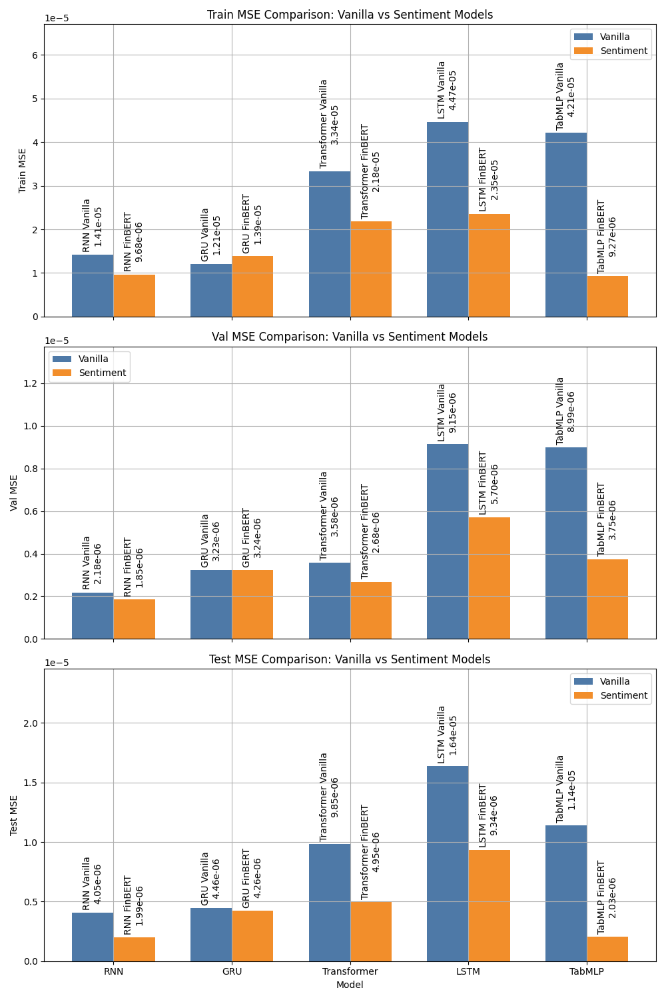

#### All tickers, sentiment threshold = 0.5
| Model | Variant | Train MSE | Val MSE | Test MSE |
|-------|---------|-----------|---------|----------|
| RNN | Vanilla | 1.6723e-05 | 3.1357e-06 | 7.1373e-06 |
| RNN | Sentiment | 1.0921e-05 | 4.1551e-06 | 1.8367e-05 |
| GRU | Vanilla | 1.4670e-05 | 3.6512e-06 | 1.3899e-05 |
| GRU | Sentiment | 2.0402e-05 | 3.2047e-06 | 1.3942e-05 |
| Transformer | Vanilla | 4.0188e-05 | 8.3193e-06 | 1.5463e-05 |
| Transformer | Sentiment | 2.5657e-05 | 4.3086e-06 | 2.8576e-05 |
| LSTM | Vanilla | 1.6572e-05 | 3.2681e-06 | 1.2189e-05 |
| LSTM | Sentiment | 1.8747e-05 | 4.2305e-06 | 1.2078e-05 |
| TabMLP | Vanilla | 2.2985e-05 | 3.9548e-06 | 3.6898e-06 |
| TabMLP | Sentiment | 1.4520e-05 | 4.2459e-06 | 1.1759e-05 |

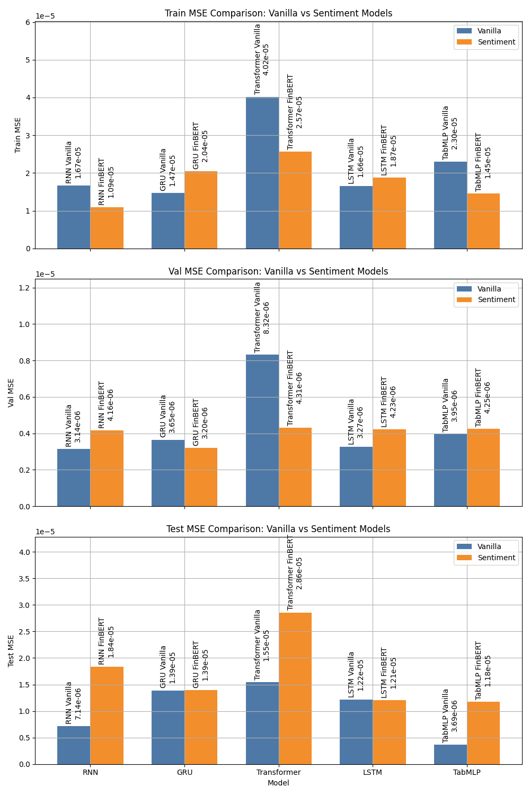

| Vanilla | Sentiment |
|---------|-----------|
| **RNN**   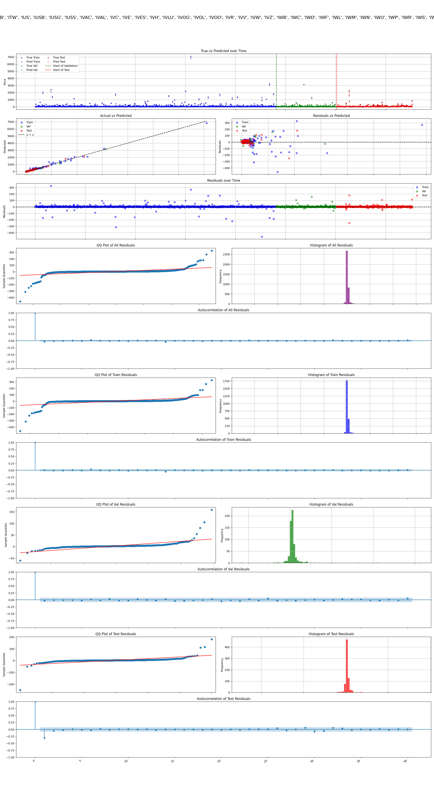 | **RNN**   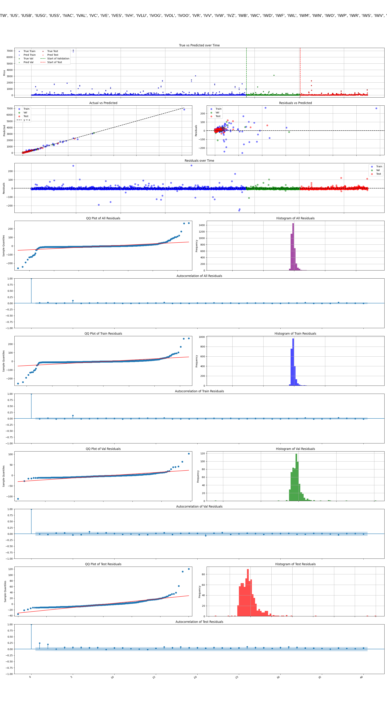 |
| **GRU**   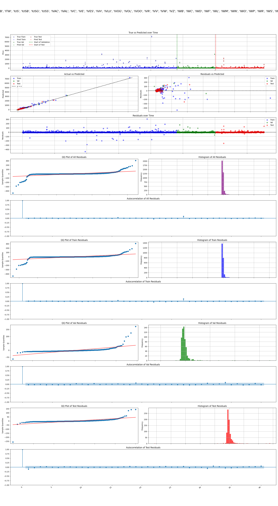 | **GRU**   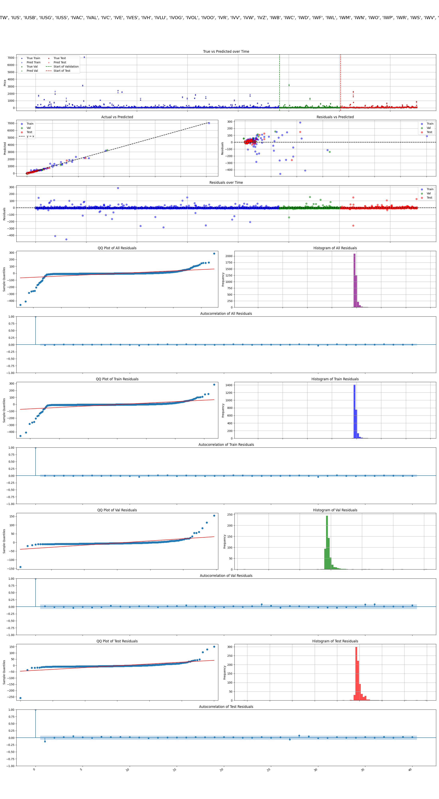 |
| **LSTM**   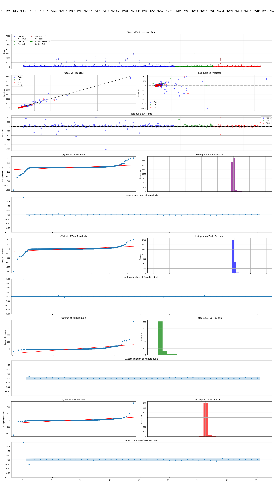 | **LSTM**   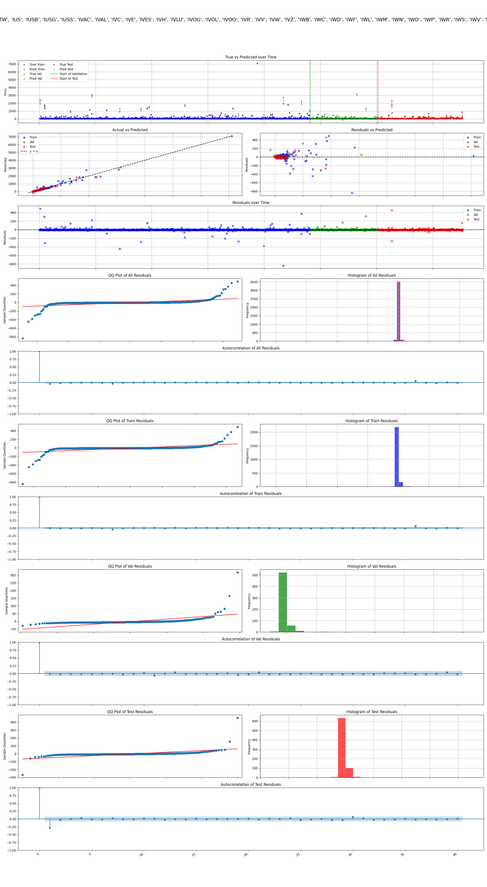 |
| **Transformer**   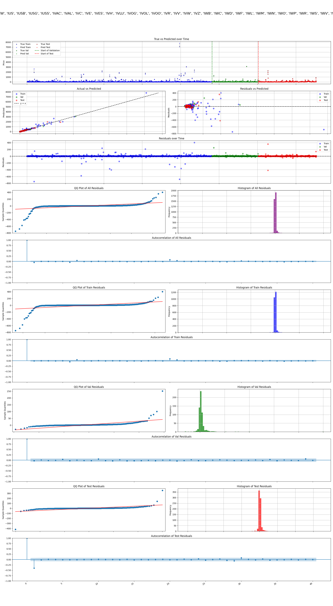 | **Transformer**   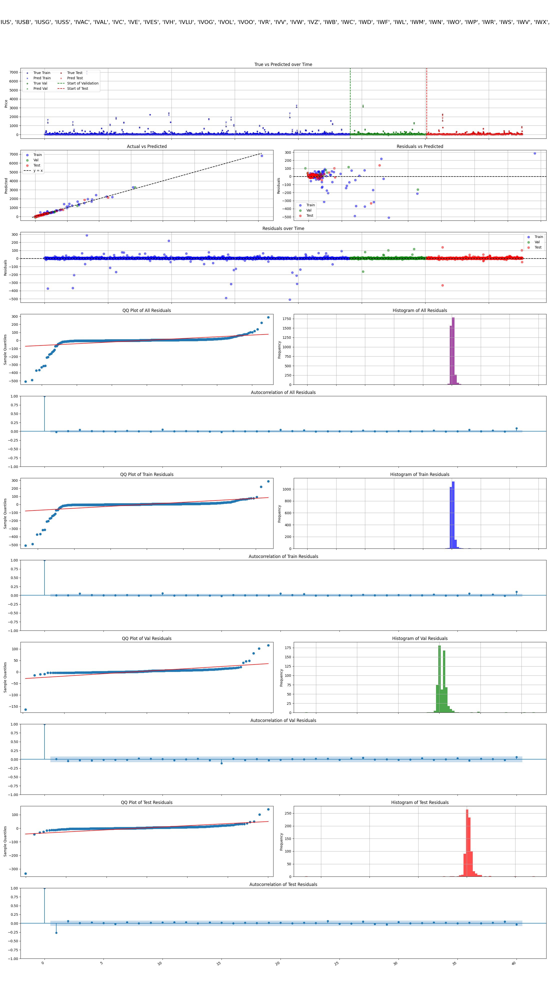 |
| **TabMLP**   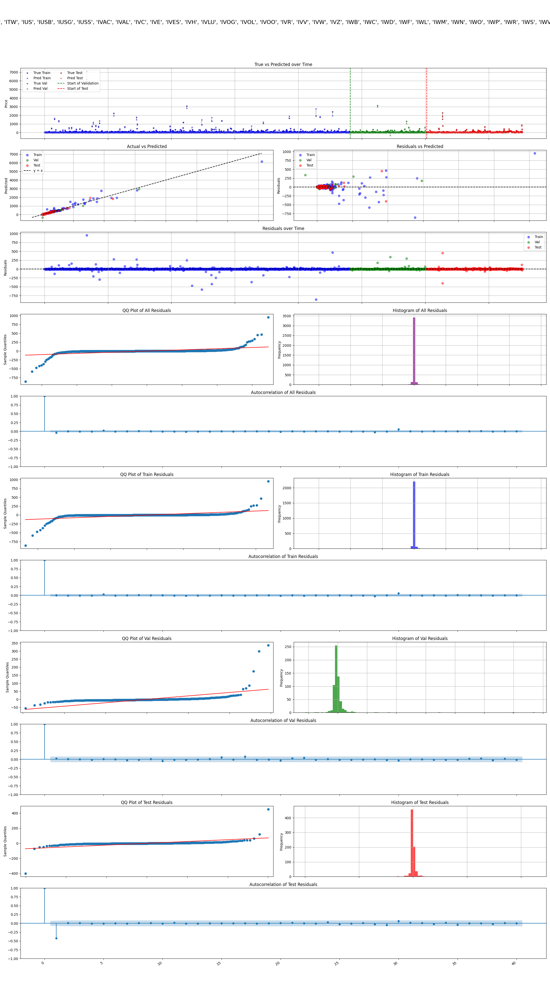 | **TabMLP**   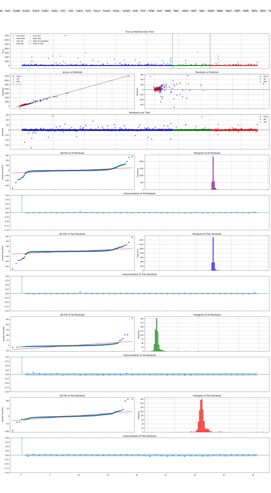

## Part 1: Sentiment Scoring and Fine-Tuning
Initially, I attempted to score sentiments using only headlines from the "Daily Financial News for 6000+ Stocks" dataset on Kaggle, which contains over 1 million entries up to 2019. However, this approach resulted in noisy sentiment scores that were not effective for improving prediction accuracy.
To address this, I switched to the Financial News and Stock Price Integration Dataset (FNSPID), which provides full article bodies along with headlines (bodies are not available in the Kaggle dataset). This enabled more comprehensive sentiment analysis, leading to better results compared to the headline-only scores.
To adapt the pre-trained FinBERT (ProsusAI/finbert) for financial tasks, I first fine-tuned it using the Numerical Sentiment Index (NSI) derived from historical stock prices (via yfinance API). NSI quantifies market-based sentiment as:
$$\begin{cases}
1 & \text{if } \text{return}_t > s \\
0 & \text{if } -s \leq \text{return}_t \leq s \\
-1 & \text{if } \text{return}_t < -s
\end{cases}   $$
with $$  \text{return}_t = \frac{\text{ClosePrice}_t - \text{OpenPrice}_t}{\text{OpenPrice}_t}  $$
and threshold $$ s = 0.01 $$

The fine-tuning process treated the task as a three-class classification problem (positive, neutral, negative), where NSI labels served as ground truth proxies for sentiment derived from market movements. This alignment helps the model better capture domain-specific nuances in financial text, as pre-trained models may not fully account for the subtleties of market sentiment. I used cross-entropy loss, the Adam optimizer with an initial learning rate of 2e-5, and trained for up to 5 epochs with early stopping based on validation loss. A batch size of 16 was employed, and I fine-tuned only the classifier head while initially freezing the base layers, followed by gradual unfreezing to allow for controlled adaptation without catastrophic forgetting. This process enhances the model's accuracy in extracting sentiment probabilities that correlate more strongly with actual stock price changes.

Using this fine-tuned FinBERT, each full article from FNSPID was then processed to extract probabilities for positive, negative, and neutral sentiments. The daily aggregated sentiment score per ticker is calculated as:
$$   \text{SentimentScore}_t = \frac{1}{N_t} \sum_{n=1}^{N_t} [P_n(\text{positive}) - P_n(\text{negative})]   $$
where N_t is the number of articles on day t.

## Part 2: Predictive Modeling with Sentiment Features
Using the fine-tuned sentiment scores, I filtered the data to include only days where the absolute sentiment score magnitude exceeded various thresholds (e.g., 0.5 and 0.8). I constructed daily features: sentiment score + lagged OHLCV market features (open, high, low, close, volume) over a look-back window (e.g., 30 days), similar to the paper's approach in using lagged OHLCV features. Features were normalized using MinMax scaling to [0,1] for stable training across varying scales. The target is the next-day closing price, normalized similarly to handle scale differences across tickers. Only data points with available sentiment were used, ensuring alignment between news and market data.
Unlike the paper, which trained models per ticker, I used data from all tickers combined and trained the models together.
I trained regressors on chronological splits (64% train, 16% validation, 20% test), comparing:
- **Vanilla models**: Lagged features only (no sentiment score).
- **Sentiment-enhanced FinBERT hybrid models**: Including sentiment score.
Models evaluated:
- **RNN (Recurrent Neural Network)**: Basic sequential model capturing temporal dependencies via hidden states; suitable for time-series but prone to vanishing gradients over long sequences.
- **GRU (Gated Recurrent Unit)**: Similar to LSTM but with fewer parameters and gates (update and reset), offering efficiency while handling long-term dependencies effectively.
- **LSTM (Long Short-Term Memory)**: Improves RNN by adding gates (forget, input, output) to handle long-term dependencies and mitigate vanishing gradients; ideal for financial time-series with non-linear patterns and persistent autocorrelations.
- **Transformer**: Leverages self-attention mechanisms to capture global dependencies in sequences without recurrence, excelling in parallel processing and modeling complex patterns in time-series data.
- **TabMLP (Tabular Multi-Layer Perceptron)**: Feed-forward neural network for tabular data; excels in capturing feature interactions via dense layers without explicit sequencing, serving as a non-recurrent baseline to benchmark against recurrent architectures.

Training used MSE loss, Adam optimizer (learning rate 0.001, with decay), batch size 1 (beneficial for capturing fine-grained patterns in sequential data, despite noisier gradient updates), and early stopping with patience 20 based on validation loss.
No regularization was applied to maintain model simplicity, relying on early stopping to prevent overfitting without suppressing learning on limited signals.
